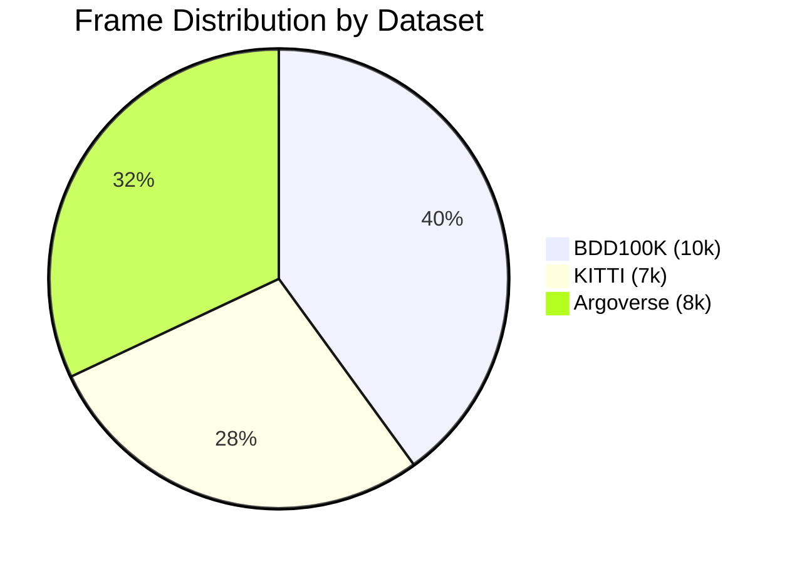
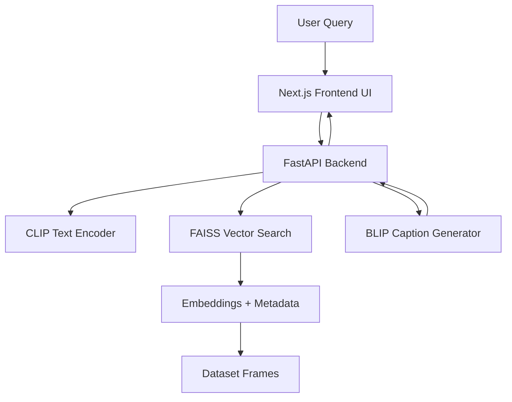

# 🚗 NAVIS — Vision-Language Multimodal Dataset Navigator  
### Built with **Latitude AI (Ford)** as part of the **Break Through Tech AI Studio Program (Fall 2025)**

<p align="center">
  
  
  
  
  
  
  
  
  
</p>

---

# 🌟 Project Highlights
- Built an end-to-end **semantic visual search engine** for autonomous-driving datasets  
- Reduced dataset exploration time from **4+ hours** to **seconds**  
- Indexed **~25,000 frames** with CLIP embeddings + FAISS HNSW search  
- BLIP captioning automatically summarizes retrieved scenes  
- Fully modular system enabling **plug-and-play extension** to new datasets  

---

# 👥 Team Members

| Name | GitHub | Contribution Area |
|------|--------|-------------------|
| **Husnain Khaliq** | https://github.com/huscse | UI / Backend - Model Integration|
| **Gagan Charagondla** | https://github.com/gagan12334 | VLM / Backend |
| **Keerthana Venkatesan** | https://github.com/keerthanavenkatesan415 | VLM / Data Processing|
| **Lissette Solano** | https://github.com/Lissette31 | Data Processing
| **Manasvi** | https://github.com/ManuPer4 | Data Processing|
| **Yesun Ang** | https://github.com/yesun-ang | VLM / Data Processing |
| **Erica Li** | https://github.com/erica-1i | UI/UX- Frontend|

---

# 🎯 Project Overview

Autonomous-vehicle (AV) companies such as **Latitude AI (Ford)** collect massive driving datasets.  
Engineers often spend **multiple hours** searching for rare but safety-critical cases—for example:  

> "a pedestrian crossing at night in the rain"

NAVIS automates and accelerates this process with:

- **Natural-language search** (“car turning left at night”)  
- **Cross-dataset semantic matching** using CLIP embeddings  
- **Fast vector retrieval** via FAISS  
- **BLIP scene captioning** for quick understanding  
- **An interactive web interface** for exploration  

### Business Relevance
NAVIS helps Latitude AI:
- Quickly surface **long-tail safety events**  
- Reduce manual review workloads  
- Improve scenario mining for **edge-case validation**  
- Accelerate AV testing and deployment readiness  

---

# 🧩 Dataset Exploration (EDA)

NAVIS works with **three real-world autonomous-driving datasets**, using scalable preprocessing and embedding pipelines.

## 📦 Datasets Used
| Dataset | Frames Used | Description |
|--------|-------------|-------------|
| **BDD100K** | ~10,000 | Diverse urban scenes, varied weather/time-of-day |
| **KITTI Raw** | 2–3 sequences (~6–9k frames) | High-quality calibrated driving data |
| **Argoverse 1.1** | 2–3 logs (~6–10k frames) | Continuous city driving sequences |

Total processed frames: **~25,000**

---

## 🗂 Example Metadata Schema

```json
{
  "frame_id": "argo_001234",
  "dataset": "Argoverse",
  "filepath": "argo/log03/001234.jpg",
  "timestamp": 1624029342,
  "weather": "rainy",
  "timeofday": "night",
  "sequence": "log03",
  "gps": [40.44062, -79.99593]
}
```

🛠 **Data Preprocessing**

### 1. Frame Extraction
- Extracted frames at 10–20 FPS  
- Converted all images to RGB  
- Resized to **640×384**

### 2. Metadata Cleaning
- Normalized weather/time labels (BDD100K)  
- Unified timestamp formatting  
- Standardized camera fields across datasets  

### 3. CLIP Embedding Generation
- Model: `openai/clip-vit-base-patch32`  
- Extracted **512-D embeddings per frame**  
- Saved outputs to:  
  - `data/embeddings/*.npy`  
  - `data/metadata/*.jsonl`

### 4. FAISS Index Construction
- Index type: **HNSW**  
- Hyperparameters:  
  - `M = 32`  
  - `efConstruction = 50`  
- Achieved **<0.5 sec** per query

### 5. BLIP Caption Generation
- Generated short scene descriptions  
- Implemented **caption caching** to avoid recomputation  

---

# 📊 EDA Insights

## 1. Dataset Distribution



## 2. Time-of-Day in BDD100K
```
Day:         █████████████████████ (61%)
Night:       ████████              (27%)
Dusk/Dawn:   ████                  (12%)
```

## 3. Weather Diversity (BDD100K Sample)
```
Clear:       ███████████████████ (70%)
Rainy:       ████                (15%)
Overcast:    ███                 (10%)
Snow:        █                   (5%)
```

---

# 🤖 Model Development & Method Justification

### Why CLIP?
- State-of-the-art vision–language alignment  
- Excels in cross-dataset generalization  
- Strong performance for semantic retrieval  

### Why BLIP?
- Produces clean, human-understandable captions  
- Helps users interpret matched frames  

### Why FAISS?
- Industry-standard ANN search  
- High recall + low latency  
- Scales to millions of vectors  

---

# 🔧 Technical Architecture

## ASCII System Diagram
```
         ┌────────────────────────────┐
         │      Next.js Frontend      │
         │  - Search bar              │
         │  - Image grid              │
         │  - Summaries               │
         └───────────┬────────────────┘
                     │  REST / JSON
                     ▼
         ┌────────────────────────────┐
         │       FastAPI Backend      │
         │  - Encode text query       │
         │  - Query FAISS index       │
         │  - Retrieve metadata       │
         │  - BLIP captioning         │
         └───────────┬────────────────┘
                     │
                     ▼
 ┌────────────────────────────────────────────┐
 │               FAISS Index (ANN)            │
 │   512D CLIP embeddings for all frames      │
 └────────────────────────────────────────────┘
                     │
                     ▼
 ┌────────────────────────────────────────────┐
 │      Raw Datasets (BDD100K, KITTI, Argo)   │
 │   + metadata + preprocessing pipelines      │
 └────────────────────────────────────────────┘
```

## Mermaid Architecture Diagram



---

# 📁 Repository Structure

```
vlm-dataset-navigator/
│
├── backend/
│   ├── api/               # FastAPI endpoints
│   ├── models/            # CLIP, BLIP models
│   ├── search/            # FAISS index + query logic
│   ├── data_loaders/      # KITTI, Argoverse, BDD100K readers
│   ├── db/                # Postgres / Supabase utilities
│   └── main.py            # FastAPI entrypoint
│
├── frontend/
│   ├── pages/             # Next.js routes
│   ├── components/        # UI components
│   └── utils/             # API helpers
│
├── notebooks/             # Embeddings + preprocessing notebooks
├── data/                  # Embeddings, metadata, example frames
├── docs/                  # Design notes + diagrams
├── tests/                 # Backend tests
│
├── docker-compose.yml
├── Dockerfile
├── requirements.txt
├── import_database.sh
└── navis_database_backup.sql
```

---

# 🗝️ Code Highlights

### Key Backend Files

- `backend/search/query.py`  
  Main FAISS retrieval logic  

- `backend/models/clip_model.py`  
  Loads CLIP and encodes frames  

- `backend/models/blip_model.py`  
  Caption generator  

- `backend/api/routes.py`  
  Request/response handling  

### Key Frontend Files

- `frontend/components/ResultCard.tsx`  
  Displays results + captions  

- `frontend/pages/index.tsx`  
  Search UI  

---

# 📈 Results & Key Findings
### Sample Query Results

| Query | Example Retrieved Result |
|--------|---------------------------|
| “car turning left at night” | Night scene with sedan turning left |
| “bicycle crossing intersection” | Cyclist in BDD100K intersection |
| “rainy road pedestrians” | KITTI pedestrian frame under rain |

---

# 🧠 Discussion & Reflection

### What Worked
- CLIP produced strong cross-dataset similarity  
- FAISS provided fast and reliable retrieval  
- Next.js + FastAPI supported modular development  

### What Didn’t
- BLIP struggles in low-light conditions  
- Embedding generation slow without GPU  
- Metadata unification required large manual effort  

### What We Learned
- Metadata standardization is critical  
- CLIP is robust across heterogeneous datasets  
- Good UI design dramatically improves user experience  

---

# 🔮 Next Steps

- Expand to full 100k-frame BDD100K dataset  
- Add temporal/video-level semantic search  
- Integrate larger CLIP models (ViT-L/14)  
- Cluster frames to auto-generate scenario tags  
- Deploy a fully hosted demo  

---

# 🛠 Installation & Running

### Option A — Docker (Recommended)

```bash
git clone https://github.com/<your-org>/vlm-dataset-navigator
cd vlm-dataset-navigator
docker-compose up --build
```

Frontend → http://localhost:3000  
Backend → http://localhost:8000  

---

### Option B — Manual Setup

#### Backend

```bash
python3 -m venv venv
source venv/bin/activate
pip install -r requirements.txt
cd backend
uvicorn main:app --reload
```

#### Frontend

```bash
cd frontend
npm install
npm run dev
```

---

# ➕ Adding New Datasets

1. Add dataset to `/data/`
2. Run embedding notebook:  
   `notebooks/generate_embeddings.ipynb`
3. Build FAISS index:  

```bash
python backend/search/build_faiss_index.py
```

4. Restart backend  

---

# 🧪 Testing

```bash
pytest tests/
```

---

# ❗ Troubleshooting

### Backend unreachable
- Confirm backend running on localhost:8000  
- Update CORS in `main.py`  

### FAISS fails to load
```bash
python backend/search/build_faiss_index.py
```

### BLIP out-of-memory (Colab)
- Lower batch size  

### Docker memory issues
- Allocate **8GB+ RAM**  

---

# 📜 License
This project is open source

---

# 🙏 Acknowledgements

Built as part of **Break Through Tech AI Studio (Fall 2025)** with support from:

- **Latitude AI (Ford)** – Host organization  
- **Sai Duddu** – AI Studio Coach  
- **Shivam Gautam & Nilesh Choubey (CMU)** – Challenge Advisors  
